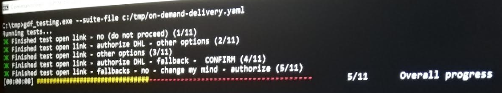
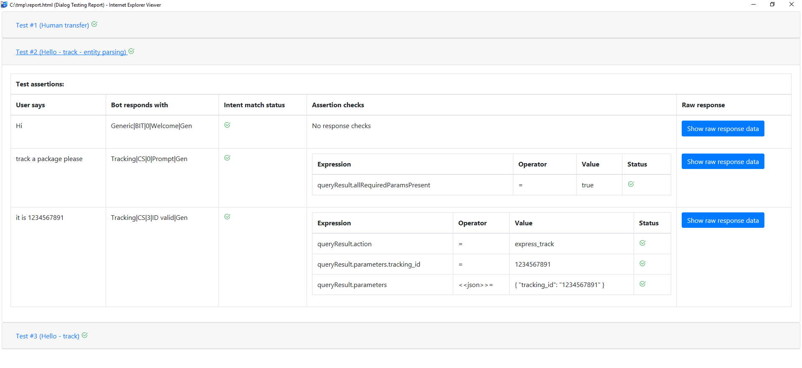
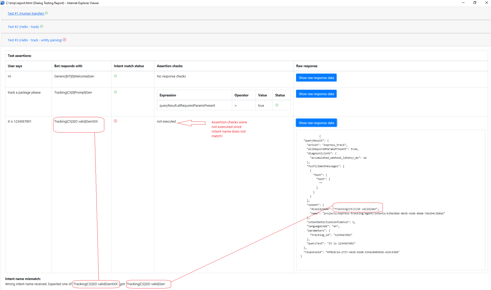
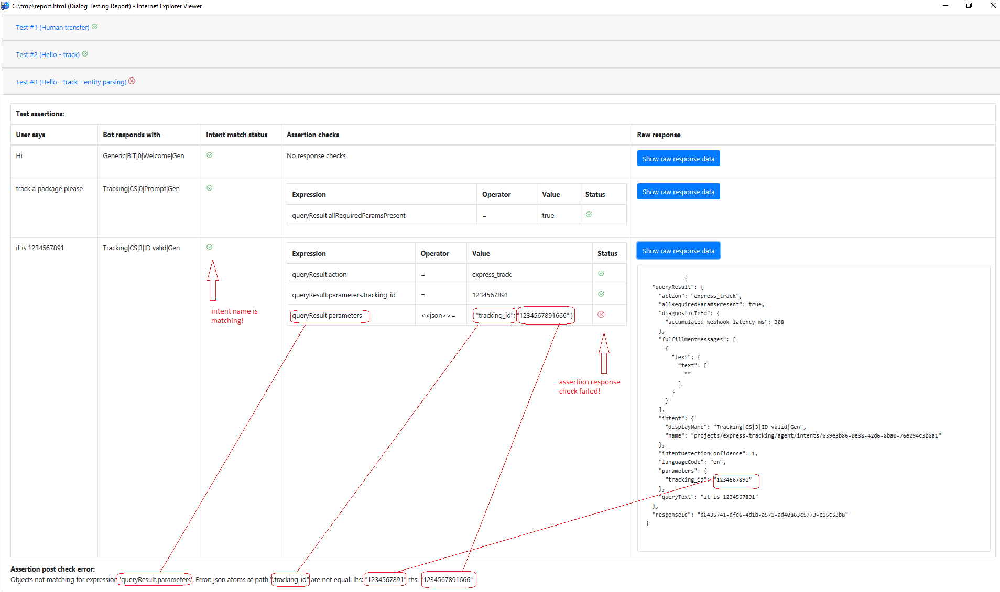

# Google DialogFlow Testing

#### *delightful chatbot Regression testing*

Command line tool for automated testing of chatbots powered by Google DialogFlow NLP

---

[Introduction](#introduction)

[Where To Get Binaries](#where-to-get-binaries)

[Core Concepts](#core-concepts)

[Test Suite YAML Format Overview](#test-suite-yaml-format-overview)

[Test Suite YAML Format Details](#test-suite-yaml-format-details)

[How Results Are Displayed](#how-results-are-displayed)

[Command Line Interface](#command-line-interface)

[Advanced examples](#advanced-examples)

[Future enhancements](#future-enhancements)

[Development Notes](#development-notes)


## Introduction

GDF Testing is command line tool that enables automated testing of chatbots created in Google DialogFlow. Automated testing ensures that:
* Dialogs (stories) that your chatbot should be capable of handling are formally documented. :thumbsup:

* Testing of new conversation designs is easier since you typically do not have to repeat all the steps of dialog over and over again. Simply write it once and let the engine replay them as needed. :thumbsup:

* **Having formalized dialog tests gives you powerful regression testing capability.** Once your bot grows big, having hundreds of intents covering many different dialogs and domains, it is very hard to ensure that new releases (regardless whether bringing new features or just amending/fixing existing ones) will not break down existing functionality. With set of rigid formal tests it is simply matter of rerunning these tests to make sure original functionality is still working as expected. :thumbsup:

GDF Testing solves these challenges by providing you with simple YAML-based format for describing tests that should be run against your chatbot. It can interact directly with DialogFlow or with chatbots hidden behind DHL Virtual Assistant Platform. Continue reading to learn more!


## Where To Get Binaries


| Version     | Binary          | OS     |
|-------------|:---------------:|--------|
| 0.1.0       | [Download here](https://en.wikipedia.org/wiki/YAML) | Windows |

Simply download the binary and start using it. No runtime installation like JRE / Node.JS / Python is needed! If you need the binary for other than Windows OS let us know, we can give it a try :smirk:

## Core concepts

GDF Testing organizes tests of your dialogs into following units:

* **Test suite**
  * Test suite is set of tests related together. Typically it covers particular domain, capability chatbot should cover, e.g. tracking, frequently asked questions, transfer to human agent, etc. Test suite is composed of one or more tests.
* **Test**
  * Test represents dialog session between user and chatbot. Each dialog consists of one or more turns/rounds. By a turn we understand user question/request and respective response provided by the chatbot. Each test represents separate conversation session, e.g. it starts with empty conversation context. As user asks further questions bot will typically establish some kind of conversation context to handle follow-up questions in natural fashion.  GDF Testing assigns to each executed test unique session/conversation ID that is passed to Google Dialogflow as session ID. This enables testing context based chatbots. 
* **Test assertion**
  * Test assertion is simply check if chatbot responded with expected intent(s). We are checking if intent name returned by DialogFlow matches one or more predefined options.
* **Test assertion check**
  * Apart from basic testing whether bot did respond with expected intent it is possible to define one or more assertion checks. These checks examine DialogFlow response for given conversation round/turn and make sure additional attributes’ values match the expectations. For example we might want to check if returned intent contains specific action, if particular output context is set, if slot filling phase is completed etc.

Test suite is defined as single text file using [YAML](https://en.wikipedia.org/wiki/YAML) format. 

## Test Suite YAML Format Overview

Below is example of test suite with single test:

```yaml
suite-spec:
    name: 'Dummy Tracking'
    type: 'DialogFlow'
    config: 
      - credentials_file: '/tmp/credentials-dialogflow.json'
tests:
    - name: 'Hello - track'
      desc: 'Simple initial two turn tracking dialog'
      lang: 'en'
      assertions:
        - userSays: 'Hello'
          botRespondsWith: 'Generic|BIT|0|Welcome|Gen'
        - userSays: 'track a package'
          botRespondsWith: ['Tracking|CS|0|Prompt|Gen']
          responseChecks:
            - expression: 'queryResult.allRequiredParamsPresent'
              operator: 'equals'
              value: true
```
Suite spec defines suite name, optional description type of invocation (Direct DialogFlow call versus DHL Virtual Assistant Platform call) and bunch of generic key/value pairs providing additional configuration.

Suite above will call Google DialogFlow directly and uses *credentials_file* parameter with path to json credentials file used to authenticate against DialogFlow.

Test (named *Hello - track*) contains simple two round/turn dialog between chatbot and user:

**User**: Hi

**Chabot**: Responds with Generic|BIT|0|Welcome|Gen intent (probably saying something like Hi, I am digital tracking assistant…)

**User**: track a package

**Chatbot**: Responds with Tracking|CS|0|Prompt|Gen  intent (asking for tracking ID)


Second test assertion contains one test assertion check, i.e. it will check that DialogFlow response contains parameter *queryResult.allRequiredParamsPresent* which is equal to value *true*.

Should we want to test same simple dialog using DHL VAP (as opposed to direct Google DialogFlow call) test suite definition would be slightly different:

```yaml
suite-spec:
    name: 'Dummy Tracking'
    type: 'DHLVAP'
    config: 
      - vap_url: 'https://vap-dev.prg-dc.dhl.com:7070'
      - vap_access_token: '00b2018c-1a78-415c-8999-0852d503b1f3'
      - vap_svc_account_email: 'dummy-cs@iam.vap.dhl.com'
      - vap_svc_account_password: 'dummyPassword123'
tests:
    - name: 'Hello - track'
      desc: 'Simple initial two turn tracking dialog'
      lang: 'es'
      assertions:
        - userSays: 'Hello'
          botRespondsWith: 'Generic|BIT|0|Welcome|Gen'
        - userSays: 'track a package'
          botRespondsWith: ['Tracking|CS|0|Prompt|Gen']
          responseChecks:
            - expression: 'dfResponse.queryResult.allRequiredParamsPresent'
              operator: 'equals'
              value: true
```

**type** attribute now contains DHLVAP, not DialogFlow.

**config** section contains DHL VAP URL, access token (same as for webchat channel) and credentials associated with DHL VAP service account which is allowed to invoke testing framework.  Should the test suite definition be stored in version control system (where storing sensitive data like passwords is not recommended) *vap_svc_account_password* attribute can be omitted in which case GDF Testing tries to retrieve it from system environment variable **VAP_SVC_ACCOUNT_PASSWORD**.

Test assertions are same (pairs of user utterance and single (*Generic|BIT|0|Welcome|Gen*) or multiple (comma delimited array of intents in brackets like **[**'*Tracking|CS|0|Prompt|Gen*'**]**) intents expected). Notice once difference in assertion response check: expression starts with *dfResponse*. This is because when using DHL VAP test suite GDF testing will return DHL VAP canonical format message, i.e. JSON with following structure:

```javascript
{
	"dfResponse": {
		/* raw DialogFlow response here */ 
	}
	"vaContext": {
		"config": {
			/* always removed for security reasons */ 
		}
		"context": {
			/* DHL VAP conversation context */ 
		}
	}
}
```

Assertion response check can thus examine both Dialogflow raw response and DHL vap metadata stored in *vaContext.context* subdocument.

## Test Suite YAML Format Details

Suite specification contains name (human readable short description) and type (*DHLVAP* or *DialogFlow* literal) and map of respective *configuration* key/value pairs

### configuration - allowed keys (DHL VAP)

* **vap_url** - URL of VAP instance where tests will be executed
* **vap_access_token** - same token as used for webchat channel
* **vap_svc_account_email** - service account email with priviledges to invoke testing framework service of DHL VAP
* **vap_svc_account_password** - service account password. It ispossible to use environment variable *VAP_SVC_ACCOUNT_PASSWORD* instead
* **vap_channel_id** - sets VAP channel. Can be used to simulate different channels.
* **vap_country** - sets VAP country. Can be used for testing country specific intents.
* **vap_context_extra** - string with extra parameters that will be merged into vaContext. If extra parameters should be appended to vap_channel_id and/or vap_country remember to start with comma (,) since you are appending. If neither vap_channel_id nor vap_country is used do not start with comma! See [Advanced examples](#advanced-examples), Express ODD example. 

### configuration - allowed keys (Google Dialogflow)

* **credentials_file** - DialogFlow JSON credentials with DialogFlow Admin API priviledges.
* **http_proxy** - can be used to setup proxy so that DialogFlow can be called from behind corporate proxy server

### Test - Specifying Target DialogFLow Language

In order to support multilingual DialogFlow agent language can be specified at test levek using **lang** attribute. If ommitted language will default to **en**. Example below shows invoking Google DialogFlow agent in its spanish version.

```yaml
suite-spec:
    name: 'Dummy Tracking'
    type: 'DialogFlow'
    config: 
      - credentials_file: '/tmp/credentials-dialogflow.json'
tests:
    - name: 'Hello - track'
      desc: 'Simple initial two turn tracking dialog'
      lang: 'es'
      assertions:
      ...
```      
      
### Test Assertion Response Checks - Operators

Supported operators are:

* equals
* !equals
* jsonequals
* includes
* length

Examples of usage below:

```yaml
responseChecks:
  - expression: 'queryResult.allRequiredParamsPresent'
    operator: 'equals'
    value: true
```

```yaml
responseChecks:
  - expression: 'queryResult.allRequiredParamsPresent'
    operator: '!equals'
    value: false
```

```yaml
responseChecks:
  - expression: 'queryResult.action'
    operator: 'includes'
    value: 'foo.bar'
```

```yaml
responseChecks:
  - expression: 'queryResult.action'
    operator: 'equals'
    value: 'express_track'
  - expression: 'queryResult.parameters'
    operator: 'jsonequals'
    value: |
    	{
      		"tracking_id": "1234567891"
    	}
```

Simple indexing is also possible:

```yaml
responseChecks:
  - expression: 'queryResult.outputContexts[0].lifespanCount'
    operator: 'equals'
    value: 3
```

Length operator can be used to examine size of JSON arrays:

```yaml
responseChecks:
  - expression: 'queryResult.outputContexts'
    operator: 'length'
    value: 2
```

## How Results Are Displayed

Consider following test suite:

```yaml
suite-spec:
    name: 'Dummy Tracking'
    type: 'DialogFlow'
    config: 
      - credentials_file: 'c:/tmp/credentials-some-gdf-agent.json'
tests:
    - name: 'Hello - track'
      desc: 'Simple initial two turn tracking dialog'
      lang: 'en'
      assertions:
        - userSays: 'Hello'
          botRespondsWith: 'Generic|BIT|0|Welcome|Gen'
        - userSays: 'track a package'
          botRespondsWith: ['Tracking|CS|0|Prompt|Gen']
          responseChecks:
            - expression: 'queryResult.allRequiredParamsPresent'
              operator: 'equals'
              value: true
    - name: 'Hello - track - entity parsing'
      desc: 'Very similar second test'
      assertions:
        - userSays: 'Hi'
          botRespondsWith: 'Generic|BIT|0|Welcome|Gen'
        - userSays: 'track a package please'
          botRespondsWith: ['Tracking|CS|0|Prompt|Gen']
          responseChecks:
            - expression: 'queryResult.allRequiredParamsPresent'
              operator: 'equals'
              value: true
        - userSays: 'it is 1234567891'
          botRespondsWith: ['Tracking|CS|3|ID valid|Gen']
          responseChecks:
            - expression: 'queryResult.action'
              operator: 'equals'
              value: 'express_track'
            - expression: 'queryResult.parameters.tracking_id'
              operator: 'equals'
              value: '1234567891'
            - expression: 'queryResult.parameters'
              operator: 'jsonequals'
              value: | 
                {
                    "tracking_id": "1234567891"
                }
    - name: 'Human transfer'
      desc: 'Initiation of human transfer'
      assertions:
        - userSays: 'talk to representative'
          botRespondsWith: 'Representative|CS|0|User request|TPh'
          responseChecks:
            - expression: 'queryResult.action'
              operator: 'equals'
              value: 'country_specific_response'                      
            - expression: 'queryResult.parameters.event'
              operator: 'equals'
              value: 'repr_user_request'  
            - expression: 'queryResult.allRequiredParamsPresent'
              operator: 'equals'
              value: true
```

Results of this test suite can be displayed in 3 different ways described below.

### Standard Output Result Reporter

In command line type following command:

```
C:\tmp>gdf_testing.exe --suite-file c:/tmp/sample_gdf.yaml
```

#### Important Notice About Standard Output Report

Standard output looks cool only when your command line is setup with sufficient height and width (both **Screen Buffer Size** and **Window Size**). Recommended values are at least 400 rows for width and at least 500 rows for height. This is especially important when getting errors and hence JSON responses displayed in *Raw response column*. Insufficient height and width will result in misformatted tables and possibly not all data visible (if buffer is too small). If you do not want to resize command line window consider using HTML report instead which uses responsive design and does not suffer from these issues.

Sample report being produced for above mentioned command:

```
C:\tmp>gdf_testing.exe --suite-file c:/tmp/sample_gdf.yaml
Running tests...
OK Finished test Human transfer (1/3)
OK Finished test Hello - track (2/3)
OK Finished test Hello - track - entity parsing (3/3)
[00:00:01] ######################################################################       3/3       All tests executed!

+---------------------------------------------------------------------------------------------------------------------------+
| Human transfer - OK                                                                                                       |
+---------------------------------------------------------------------------------------------------------------------------+
| +------------------------+--------------------------------------+---------------------+------------------+--------------+ |
| | User says              | Bot responds with                    | Intent match status | Assertion checks | Raw response | |
| +------------------------+--------------------------------------+---------------------+------------------+--------------+ |
| | talk to representative | Representative|CS|0|User request|TPh | OK                  | OK               |              | |
| +------------------------+--------------------------------------+---------------------+------------------+--------------+ |
+---------------------------------------------------------------------------------------------------------------------------+
+---------------------------------------------------------------------------------------------------------+
| Hello - track - OK                                                                                      |
+---------------------------------------------------------------------------------------------------------+
| +-----------------+---------------------------+---------------------+------------------+--------------+ |
| | User says       | Bot responds with         | Intent match status | Assertion checks | Raw response | |
| +-----------------+---------------------------+---------------------+------------------+--------------+ |
| | Hello           | Generic|BIT|0|Welcome|Gen | OK                  | N/A              |              | |
| +-----------------+---------------------------+---------------------+------------------+--------------+ |
| | track a package | Tracking|CS|0|Prompt|Gen  | OK                  | OK               |              | |
| +-----------------+---------------------------+---------------------+------------------+--------------+ |
+---------------------------------------------------------------------------------------------------------+
+-----------------------------------------------------------------------------------------------------------------+
| Hello - track - entity parsing - OK                                                                             |
+-----------------------------------------------------------------------------------------------------------------+
| +------------------------+----------------------------+---------------------+------------------+--------------+ |
| | User says              | Bot responds with          | Intent match status | Assertion checks | Raw response | |
| +------------------------+----------------------------+---------------------+------------------+--------------+ |
| | Hi                     | Generic|BIT|0|Welcome|Gen  | OK                  | N/A              |              | |
| +------------------------+----------------------------+---------------------+------------------+--------------+ |
| | track a package please | Tracking|CS|0|Prompt|Gen   | OK                  | OK               |              | |
| +------------------------+----------------------------+---------------------+------------------+--------------+ |
| | it is 1234567891       | Tracking|CS|3|ID valid|Gen | OK                  | OK               |              | |
| +------------------------+----------------------------+---------------------+------------------+--------------+ |
+-----------------------------------------------------------------------------------------------------------------+
```

Notes:

* When assertion is evaluated successfully (i.e. both returned intent name matches expectation and all response check assertions are met) raw DialogFlow/DHL VAP response is not displayed in standard output report. If you want to see it anyway see HTML report section.

* If there are no assertion response checks defined for given assertion value **N/A** id displayed in **Assertion checks** column

If intent name will not match result will look like below:

```yaml
C:\tmp>gdf_testing.exe --suite-file c:/tmp/sample_gdf.yaml
Running tests...
OK Finished test Human transfer (1/3)
KO Finished test Hello - track (2/3)
OK Finished test Hello - track - entity parsing (3/3)
[00:00:02] ######################################################################       3/3       All tests executed!

+---------------------------------------------------------------------------------------------------------------------------+
| Human transfer - OK                                                                                                       |
+---------------------------------------------------------------------------------------------------------------------------+
| +------------------------+--------------------------------------+---------------------+------------------+--------------+ |
| | User says              | Bot responds with                    | Intent match status | Assertion checks | Raw response | |
| +------------------------+--------------------------------------+---------------------+------------------+--------------+ |
| | talk to representative | Representative|CS|0|User request|TPh | OK                  | OK               |              | |
| +------------------------+--------------------------------------+---------------------+------------------+--------------+ |
+---------------------------------------------------------------------------------------------------------------------------+
+-------------------------------------------------------------------------------------------------------------------------------------------------------------------------------------------------------------------------------------------------------------------------------------------------------------------------------------------+
| Hello - track - KO                                                                                                                                                                                                                                                                                                                        |
| Wrong intent name received. Expected one of: 'Generic|BIT|0|Welcome|Gen2', got: 'Generic|BIT|0|Welcome|Gen'                                                                                                                                                                                                                               |
+-------------------------------------------------------------------------------------------------------------------------------------------------------------------------------------------------------------------------------------------------------------------------------------------------------------------------------------------+
| +-----------+----------------------------+---------------------+------------------+-----------------------------------------------------------------------------------------------------------------------------------------------------------------------------------------------------------------------------------------------------+ |
| | User says | Bot responds with          | Intent match status | Assertion checks | Raw response                                                                                                                                                                                                                                        | |
| +-----------+----------------------------+---------------------+------------------+-----------------------------------------------------------------------------------------------------------------------------------------------------------------------------------------------------------------------------------------------------+ |
| | Hello     | Generic|BIT|0|Welcome|Gen2 | KO                  | Not executed     | {                                                                                                                                                                                                                                                   | |
| |           |                            |                     |                  |   "queryResult": {                                                                                                                                                                                                                                  | |
| |           |                            |                     |                  |     "action": "input.welcome",                                                                                                                                                                                                                      | |
| |           |                            |                     |                  |     "allRequiredParamsPresent": true,                                                                                                                                                                                                               | |
| |           |                            |                     |                  |     "fulfillmentMessages": [                                                                                                                                                                                                                        | |
| |           |                            |                     |                  |       {                                                                                                                                                                                                                                             | |
| |           |                            |                     |                  |         "platform": "SLACK",                                                                                                                                                                                                                        | |
| |           |                            |                     |                  |         "quickReplies": {                                                                                                                                                                                                                           | |
| |           |                            |                     |                  |           "quickReplies": [                                                                                                                                                                                                                         | |
| |           |                            |                     |                  |             "Track a package",                                                                                                                                                                                                                      | |
| |           |                            |                     |                  |             "Manage delivery",                                                                                                                                                                                                                      | |
| |           |                            |                     |                  |             "Pay duties",                                                                                                                                                                                                                           | |
| |           |                            |                     |                  |             "Commercial invoice",                                                                                                                                                                                                                   | |
| |           |                            |                     |                  |             "Get a quote"                                                                                                                                                                                                                           | |
| |           |                            |                     |                  |           ]                                                                                                                                                                                                                                         | |
| |           |                            |                     |                  |         }                                                                                                                                                                                                                                           | |
| |           |                            |                     |                  |       },                                                                                                                                                                                                                                            | |
| |           |                            |                     |                  |       {                                                                                                                                                                                                                                             | |
| |           |                            |                     |                  |         "platform": "LINE",                                                                                                                                                                                                                         | |
| |           |                            |                     |                  |         "text": {                                                                                                                                                                                                                                   | |
| |           |                            |                     |                  |           "text": [                                                                                                                                                                                                                                 | |
| |           |                            |                     |                  |             "Hi, this is DHL Express, your specialist in international shipping. I can track a package if you provide a 10 digit shipment number. I can also provide rate quotes."                                                                  | |
| |           |                            |                     |                  |           ]                                                                                                                                                                                                                                         | |
| |           |                            |                     |                  |         }                                                                                                                                                                                                                                           | |
| |           |                            |                     |                  |       },                                                                                                                                                                                                                                            | |
| |           |                            |                     |                  |       {                                                                                                                                                                                                                                             | |
| |           |                            |                     |                  |         "platform": "FACEBOOK",                                                                                                                                                                                                                     | |
| |           |                            |                     |                  |         "quickReplies": {                                                                                                                                                                                                                           | |
| |           |                            |                     |                  |           "quickReplies": [                                                                                                                                                                                                                         | |
| |           |                            |                     |                  |             "Track a package",                                                                                                                                                                                                                      | |
| |           |                            |                     |                  |             "Manage delivery",                                                                                                                                                                                                                      | |
| |           |                            |                     |                  |             "Pay duties",                                                                                                                                                                                                                           | |
| |           |                            |                     |                  |             "Commercial invoice",                                                                                                                                                                                                                   | |
| |           |                            |                     |                  |             "Get a quote"                                                                                                                                                                                                                           | |
| |           |                            |                     |                  |           ]                                                                                                                                                                                                                                         | |
| |           |                            |                     |                  |         }                                                                                                                                                                                                                                           | |
| |           |                            |                     |                  |       },                                                                                                                                                                                                                                            | |
| |           |                            |                     |                  |       {                                                                                                                                                                                                                                             | |
| |           |                            |                     |                  |         "platform": "ACTIONS_ON_GOOGLE",                                                                                                                                                                                                            | |
| |           |                            |                     |                  |         "simpleResponses": {                                                                                                                                                                                                                        | |
| |           |                            |                     |                  |           "simpleResponses": [                                                                                                                                                                                                                      | |
| |           |                            |                     |                  |             {                                                                                                                                                                                                                                       | |
| |           |                            |                     |                  |               "ssml": "<speak><prosody rate=\"115%\"><s>Welcome to DHL Express, your specialist in international shipping.</s>\n<s>I can track a package or provide rate quotes.</s></prosody></speak>"                                             | |
| |           |                            |                     |                  |             }                                                                                                                                                                                                                                       | |
| |           |                            |                     |                  |           ]                                                                                                                                                                                                                                         | |
| |           |                            |                     |                  |         }                                                                                                                                                                                                                                           | |
| |           |                            |                     |                  |       },                                                                                                                                                                                                                                            | |
| |           |                            |                     |                  |       {                                                                                                                                                                                                                                             | |
| |           |                            |                     |                  |         "platform": "SKYPE",                                                                                                                                                                                                                        | |
| |           |                            |                     |                  |         "quickReplies": {                                                                                                                                                                                                                           | |
| |           |                            |                     |                  |           "quickReplies": [                                                                                                                                                                                                                         | |
| |           |                            |                     |                  |             "Track a package",                                                                                                                                                                                                                      | |
| |           |                            |                     |                  |             "Manage delivery",                                                                                                                                                                                                                      | |
| |           |                            |                     |                  |             "Pay duties",                                                                                                                                                                                                                           | |
| |           |                            |                     |                  |             "Commercial invoice",                                                                                                                                                                                                                   | |
| |           |                            |                     |                  |             "Get a quote"                                                                                                                                                                                                                           | |
| |           |                            |                     |                  |           ]                                                                                                                                                                                                                                         | |
| |           |                            |                     |                  |         }                                                                                                                                                                                                                                           | |
| |           |                            |                     |                  |       },                                                                                                                                                                                                                                            | |
| |           |                            |                     |                  |       {                                                                                                                                                                                                                                             | |
| |           |                            |                     |                  |         "text": {                                                                                                                                                                                                                                   | |
| |           |                            |                     |                  |           "text": [                                                                                                                                                                                                                                 | |
| |           |                            |                     |                  |             "Hi, this is DHL Express, your specialist in international shipping. I can track a package if you provide a 10 digit shipment number. I can also provide rate quotes. You can also find me on Whatsapp at +1-480-418-5011."             | |
| |           |                            |                     |                  |           ]                                                                                                                                                                                                                                         | |
| |           |                            |                     |                  |         }                                                                                                                                                                                                                                           | |
| |           |                            |                     |                  |       }                                                                                                                                                                                                                                             | |
| |           |                            |                     |                  |     ],                                                                                                                                                                                                                                              | |
| |           |                            |                     |                  |     "fulfillmentText": "Hi, this is DHL Express, your specialist in international shipping. I can track a package if you provide a 10 digit shipment number. I can also provide rate quotes. You can also find me on Whatsapp at +1-480-418-5011.", | |
| |           |                            |                     |                  |     "intent": {                                                                                                                                                                                                                                     | |
| |           |                            |                     |                  |       "displayName": "Generic|BIT|0|Welcome|Gen",                                                                                                                                                                                                   | |
| |           |                            |                     |                  |       "name": "projects/express-tracking/agent/intents/b1967059-d268-4c12-861d-9d71e710b3f5"                                                                                                                                                        | |
| |           |                            |                     |                  |     },                                                                                                                                                                                                                                              | |
| |           |                            |                     |                  |     "intentDetectionConfidence": 1,                                                                                                                                                                                                                 | |
| |           |                            |                     |                  |     "languageCode": "en",                                                                                                                                                                                                                           | |
| |           |                            |                     |                  |     "outputContexts": [                                                                                                                                                                                                                             | |
| |           |                            |                     |                  |       {                                                                                                                                                                                                                                             | |
| |           |                            |                     |                  |         "lifespanCount": 1,                                                                                                                                                                                                                         | |
| |           |                            |                     |                  |         "name": "projects/express-tracking/agent/sessions/AFE29479-A194-BD25-9432-2161C27FE82F/contexts/tracking_prompt"                                                                                                                            | |
| |           |                            |                     |                  |       }                                                                                                                                                                                                                                             | |
| |           |                            |                     |                  |     ],                                                                                                                                                                                                                                              | |
| |           |                            |                     |                  |     "parameters": {},                                                                                                                                                                                                                               | |
| |           |                            |                     |                  |     "queryText": "Hello",                                                                                                                                                                                                                           | |
| |           |                            |                     |                  |     "sentimentAnalysisResult": {                                                                                                                                                                                                                    | |
| |           |                            |                     |                  |       "queryTextSentiment": {                                                                                                                                                                                                                       | |
| |           |                            |                     |                  |         "magnitude": 0.2,                                                                                                                                                                                                                           | |
| |           |                            |                     |                  |         "score": 0.2                                                                                                                                                                                                                                | |
| |           |                            |                     |                  |       }                                                                                                                                                                                                                                             | |
| |           |                            |                     |                  |     }                                                                                                                                                                                                                                               | |
| |           |                            |                     |                  |   },                                                                                                                                                                                                                                                | |
| |           |                            |                     |                  |   "responseId": "31e1c605-1adf-48f6-8770-045ddab14583-e15c53b8"                                                                                                                                                                                     | |
| |           |                            |                     |                  | }                                                                                                                                                                                                                                                   | |
| +-----------+----------------------------+---------------------+------------------+-----------------------------------------------------------------------------------------------------------------------------------------------------------------------------------------------------------------------------------------------------+ |
+-------------------------------------------------------------------------------------------------------------------------------------------------------------------------------------------------------------------------------------------------------------------------------------------------------------------------------------------+
+-----------------------------------------------------------------------------------------------------------------+
| Hello - track - entity parsing - OK                                                                             |
+-----------------------------------------------------------------------------------------------------------------+
| +------------------------+----------------------------+---------------------+------------------+--------------+ |
| | User says              | Bot responds with          | Intent match status | Assertion checks | Raw response | |
| +------------------------+----------------------------+---------------------+------------------+--------------+ |
| | Hi                     | Generic|BIT|0|Welcome|Gen  | OK                  | N/A              |              | |
| +------------------------+----------------------------+---------------------+------------------+--------------+ |
| | track a package please | Tracking|CS|0|Prompt|Gen   | OK                  | OK               |              | |
| +------------------------+----------------------------+---------------------+------------------+--------------+ |
| | it is 1234567891       | Tracking|CS|3|ID valid|Gen | OK                  | OK               |              | |
| +------------------------+----------------------------+---------------------+------------------+--------------+ |
+-----------------------------------------------------------------------------------------------------------------+


C:\tmp>
```

Notes:

* In this case DialogFlow raw response is displayed for assertion that failed so that it is possible to investigate what went wrong
* Following assertions of given tests are not executed and hence not displyaed
* Column **Assertion checks** shows **Not executed** since assertion checks has not been executed! If intent name does not match it makes no sense to exeute additional checks.

If intent name will match but assertion check will fail result will look like below: 

```
C:\tmp>gdf_testing.exe --suite-file c:/tmp/sample_gdf.yaml
Running tests...
OK Finished test Human transfer (1/3)
OK Finished test Hello - track (2/3)
KO Finished test Hello - track - entity parsing (3/3)
[00:00:01] ######################################################################       3/3       All tests executed!

+---------------------------------------------------------------------------------------------------------------------------+
| Human transfer - OK                                                                                                       |
+---------------------------------------------------------------------------------------------------------------------------+
| +------------------------+--------------------------------------+---------------------+------------------+--------------+ |
| | User says              | Bot responds with                    | Intent match status | Assertion checks | Raw response | |
| +------------------------+--------------------------------------+---------------------+------------------+--------------+ |
| | talk to representative | Representative|CS|0|User request|TPh | OK                  | OK               |              | |
| +------------------------+--------------------------------------+---------------------+------------------+--------------+ |
+---------------------------------------------------------------------------------------------------------------------------+
+---------------------------------------------------------------------------------------------------------+
| Hello - track - OK                                                                                      |
+---------------------------------------------------------------------------------------------------------+
| +-----------------+---------------------------+---------------------+------------------+--------------+ |
| | User says       | Bot responds with         | Intent match status | Assertion checks | Raw response | |
| +-----------------+---------------------------+---------------------+------------------+--------------+ |
| | Hello           | Generic|BIT|0|Welcome|Gen | OK                  | N/A              |              | |
| +-----------------+---------------------------+---------------------+------------------+--------------+ |
| | track a package | Tracking|CS|0|Prompt|Gen  | OK                  | OK               |              | |
| +-----------------+---------------------------+---------------------+------------------+--------------+ |
+---------------------------------------------------------------------------------------------------------+
+-----------------------------------------------------------------------------------------------------------------------------------------------------------------------------------------------------------------------------------------------------------+
| Hello - track - entity parsing - KO                                                                                                                                                                                                                       |
| Expected value '1234567891' does match real value: '1234567891' for expression: queryResult.parameters.tracking_id                                                                                                                                        |
+-----------------------------------------------------------------------------------------------------------------------------------------------------------------------------------------------------------------------------------------------------------+
| +------------------------+----------------------------+---------------------+----------------------------------------------------------------------------+----------------------------------------------------------------------------------------------+ |
| | User says              | Bot responds with          | Intent match status | Assertion checks                                                           | Raw response                                                                                 | |
| +------------------------+----------------------------+---------------------+----------------------------------------------------------------------------+----------------------------------------------------------------------------------------------+ |
| | Hi                     | Generic|BIT|0|Welcome|Gen  | OK                  | N/A                                                                        |                                                                                              | |
| +------------------------+----------------------------+---------------------+----------------------------------------------------------------------------+----------------------------------------------------------------------------------------------+ |
| | track a package please | Tracking|CS|0|Prompt|Gen   | OK                  | OK                                                                         |                                                                                              | |
| +------------------------+----------------------------+---------------------+----------------------------------------------------------------------------+----------------------------------------------------------------------------------------------+ |
| | it is 1234567891       | Tracking|CS|3|ID valid|Gen | OK                  | +------------------------------------+----------+---------------+--------+ | {                                                                                            | |
| |                        |                            |                     | | Expression                         | Operator | Value         | Status | |   "queryResult": {                                                                           | |
| |                        |                            |                     | +------------------------------------+----------+---------------+--------+ |     "action": "express_track",                                                               | |
| |                        |                            |                     | | queryResult.action                 | =        | express_track | OK     | |     "allRequiredParamsPresent": true,                                                        | |
| |                        |                            |                     | +------------------------------------+----------+---------------+--------+ |     "diagnosticInfo": {                                                                      | |
| |                        |                            |                     | | queryResult.parameters.tracking_id | !=       | 1234567891    | KO     | |       "accumulated_webhook_latency_ms": 23                                                   | |
| |                        |                            |                     | +------------------------------------+----------+---------------+--------+ |     },                                                                                       | |
| |                        |                            |                     |                                                                            |     "fulfillmentMessages": [                                                                 | |
| |                        |                            |                     |                                                                            |       {                                                                                      | |
| |                        |                            |                     |                                                                            |         "text": {                                                                            | |
| |                        |                            |                     |                                                                            |           "text": [                                                                          | |
| |                        |                            |                     |                                                                            |             ""                                                                               | |
| |                        |                            |                     |                                                                            |           ]                                                                                  | |
| |                        |                            |                     |                                                                            |         }                                                                                    | |
| |                        |                            |                     |                                                                            |       }                                                                                      | |
| |                        |                            |                     |                                                                            |     ],                                                                                       | |
| |                        |                            |                     |                                                                            |     "intent": {                                                                              | |
| |                        |                            |                     |                                                                            |       "displayName": "Tracking|CS|3|ID valid|Gen",                                           | |
| |                        |                            |                     |                                                                            |       "name": "projects/express-tracking/agent/intents/639e3b86-0e38-42d6-8ba0-76e294c3b8a1" | |
| |                        |                            |                     |                                                                            |     },                                                                                       | |
| |                        |                            |                     |                                                                            |     "intentDetectionConfidence": 1,                                                          | |
| |                        |                            |                     |                                                                            |     "languageCode": "en",                                                                    | |
| |                        |                            |                     |                                                                            |     "parameters": {                                                                          | |
| |                        |                            |                     |                                                                            |       "tracking_id": "1234567891"                                                            | |
| |                        |                            |                     |                                                                            |     },                                                                                       | |
| |                        |                            |                     |                                                                            |     "queryText": "it is 1234567891"                                                          | |
| |                        |                            |                     |                                                                            |   },                                                                                         | |
| |                        |                            |                     |                                                                            |   "responseId": "9f5ca6a9-5a81-43a8-bb2e-46fd5fb99103-c1292b34"                              | |
| |                        |                            |                     |                                                                            | }                                                                                            | |
| +------------------------+----------------------------+---------------------+----------------------------------------------------------------------------+----------------------------------------------------------------------------------------------+ |
+-----------------------------------------------------------------------------------------------------------------------------------------------------------------------------------------------------------------------------------------------------------+
```

Notes:

* In this case column **Assertion checks** shows detailed table of checks up to check which failed (Status is *KO*). No further checks are displayed since they were not executed
* Again detailed DialogFlow/DHL VAP response is included so that investigation of test failure root cause is possible

C:\tmp>


### HTML Output Result Reporter

In order to generate HTML report just add **html-report** switch:

```
C:\tmp>gdf_testing.exe --suite-file c:/tmp/sample_gdf.yaml --html-report c:/tmp/report.html
```

#### Successfull execution



Notes:

* Apart from standard output report we are displaying all assertion response checks and full DialogFlow responses even if everything goes OK. We can simply squeeze more information in HTML report!

* If there are no response checks defined for given assertion it is indicated with *No response checks* value in respective columns.

#### Intent name mismatch error



Notes:

* In this case intent name is not matching hence response checks were not even executed! Error message with DialogFlow response gives the user all the data needed to troubleshoot the issue.

#### Assertion check error (intent name is matching)



Notes:

* In this case particular assertion check failed
* Operator for checking json equality (jsonequals in yaml file) is represented by value *<<json>>=*
* Notice how multiline json string can be put into response check value. This is especially usefull when using jsonequals operator!
	```yaml
              operator: 'jsonequals'
              value: | 
                {
                    "tracking_id": "1234567891"
                }
	```

### JSON Output Result Reporter

For CI/CD pipelines and automated processing of test results (by different scripts for example) we are providing possibility generate test results into json file.

In order to generate HTML report just add **json-report** switch:

```
C:\tmp>gdf_testing.exe --suite-file c:/tmp/sample_gdf.yaml --json-report c:/tmp/report.html
Running tests...
OK Finished test Human transfer (1/3)
OK Finished test Hello - track (2/3)
OK Finished test Hello - track - entity parsing (3/3)
...
```

### Disabling Standard Output Report

When working predominantly with HTML or JSON reports it might be sometimes undesired and tiring if the standard output report is displayed. To prevent this default report switch *--disable-stdout-report* can be used. Example:

```
C:\tmp>gdf_testing.exe --suite-file c:/tmp/sample_gdf.yaml --json-report c:/tmp/report.html --disable-stdout-report
Running tests...
OK Finished test Human transfer (1/3)
OK Finished test Hello - track (2/3)
OK Finished test Hello - track - entity parsing (3/3)
[00:00:01] ######################################################################       3/3       All tests executed!

C:\tmp>
```


## Command Line Interface

Simply ask for help:
```
C:\tmp>gdf_testing.exe -h
Google DialogFlow Testing 0.1.0
Adam Bezecny
Tool for automated testing of chatbots based on Google DialogFlow NLP

USAGE:
    gdf_testing.exe [FLAGS] [OPTIONS] --suite-file <FILE>

FLAGS:
    -h, --help                     Prints help information
        --disable-stdout-report    Disables default report printed to standard output
    -V, --version                  Prints version information

OPTIONS:
        --html-report <FILE>           Path to optional html report
        --json-report <FILE>           Path to optional json report
    -f, --suite-file <FILE>            Yaml file with test suite definition
    -t, --threadpool-size <INTEGER>    Number of worker threads for parallel test execution. If not specified defaults
                                       to 4. [default: 4]
```

## Advanced examples

Table below provides links to two more complex test suite examples. 

| Name     |     Description                                        |  Link       |
|----------------------|:------------------------------------------:|------------:|
| Sample DialogFlow Suite       | Sample test suite conencting to DialogFlow directly | [link](./examples/sample_gdf.yaml) |
| Sample DHL VAP Suite       | Same suite as above just going through DHL VAP | [link](./examples/sample_vap.yaml) |
| Express CS ODD       | Complex test suite for Express ODD chatbot | [link](./examples/complex_sample_1.yaml) |
| Express CS Tracking  | Express tracking use cases, demonstrates<br>country specific features   | [link](./examples/complex_sample_2.yaml) |
                         		    	

## Future enhancements

In the near future (**if the demand for this tool will exist**) following enhancements are planned:

* skip flag (in YAML file) to enable/disable test execution declaratively
* command line switch enabling to execute only selected test(s)
* command line interface enhancements to enable to run multiple test suites
* wrapping the utility into server side component for centralized test suites execution

Feedback on desired features/potential improvements/bugs is welcome. Simply submit issue [here](https://github.com/adambezecny/gdf-testing/issues)!

## Development Notes

Use RUST_LOG variable to setup debug logging for particular modules. Example:

```
set RUST_LOG=gdf_testing::thread_pool=debug 
set RUST_LOG=gdf_testing::thread_pool=debug,gdf_testing::test_executors::gdf_executor=debug
```

Currently following modules produce debug logs:

* gdf_testing::cmdl_parser
* gdf_testing::thread_pool
* gdf_testing::test_executors::gdf_executor
* gdf_testing::test_executors::vap_executor

Enabling logging without module specification will enable it even for third party libraries used (e.g. [reqwest](https://crates.io/crates/reqwest))

For further detials about logging configuration see [env_logger](https://crates.io/crates/env_logger)
